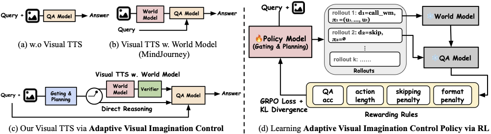

# When and How Much to Imagine: Adaptive Test-Time Scaling with World Models for Visual Spatial Reasoning

This is the official implementation for adaptive visual imagination control

[](https://adaptive-visual-tts.github.io/)  [](https://arxiv.org/abs/2602.08236)

### Authors: [Shoubin Yu*](https://yui010206.github.io/), [Yue Zhang*](https://zhangyuejoslin.github.io/), [Zun Wang](https://zunwang1.github.io/), [Jaehong Yoon](https://jaehong31.github.io/), [Huaxiu Yao](https://huaxiuyao.strikingly.com/), [Mingyu Ding](https://dingmyu.github.io/), [Mohit Bansal](https://www.cs.unc.edu/~mbansal/)

### University of North Carolina at Chapel Hill, Nanyang Technological University


Figure 1. Different cases in always-on visual imagination. Imagined views are generated independently for different beam-searched actions (shown by multiple arrows). Case 1 (Helpful): Visual imagination reveals previously unseen viewpoints, enabling helpful spatial reasoning. Case 2 (Misleading): Imagination fails to preserve task-relevant objects (e.g., the white table in the red box), resulting in incorrect spatial inference and wrong answers. Case 3 (Unnecessary): The required information is already clearly observable in the original view (e.g., the bathtub in the blue box), making additional imagined views redundant.



# **Installation**

## for visual spatial reasoning

A single Conda environment holds the VLM framework, the SVC world model, and the
RL training stack:

```bash
cd visual_spatial_reasoning
conda create -n avic python=3.11 -y
conda activate avic

# CUDA 12.6 builds of PyTorch (adjust to your CUDA)
pip install torch==2.6.0+cu126 torchvision==0.21.0+cu126 torchaudio==2.6.0+cu126 \
  --extra-index-url https://download.pytorch.org/whl/cu126

# Stable Virtual Camera world model (editable install; deps in pyproject.toml)
pip install -e stable_virtual_camera/

# Extra deps for RL (GRPO) policy training
pip install -r requirements_train.txt
```

See [`visual_spatial_reasoning/README.md`](visual_spatial_reasoning/README.md)
for the full environment, data-preparation, training-free, and RL-training
instructions, including how to download the SAT dataset.

## for navigation

Please follow [MapGPT](https://github.com/chen-judge/MapGPT/?tab=readme-ov-file) instructions for setting up Room2Room evaluation environment.

You need to 

(1) Install Matterport3D simulators: follow instructions [here](https://github.com/peteanderson80/Matterport3DSimulator). We use the latest version instead of v0.1.

(2) And then install MapGPT dependencies and data.

(3) install stable virtual camera as in visual spatial reasoning. 

We install environment with docker, and re-compile Matterport3D with python 3.10,
in this case, you will need to download anaconda in the docker environment. 


# Experiments

please set up your API keys in api.py for both tasks before running experiments.


## visual spatial reasoning

Training-free AVIC (closed-source VLM + SVC world model):

```bash
cd visual_spatial_reasoning
sh scripts/pipeline_avic.sh
```

RL-trained policy (GRPO). Prepare the `train` split, then train and evaluate:

```bash
cd visual_spatial_reasoning
python utils/data_process.py --split train      # train images for RL
sh scripts/train_qwen_grpo.sh                    # 8-GPU online GRPO training
sh scripts/batch_eval_ckpts.sh nips_results/<run_dir>   # evaluate checkpoints
```

Our best policy is the `adapter_step140` LoRA adapter (Qwen2.5-VL-7B base,
+6 pts over base on SAT test). The checkpoint will be released on Hugging Face;
its exact training and evaluation settings are documented in
[`visual_spatial_reasoning/README.md`](visual_spatial_reasoning/README.md),
which also covers data preparation, hyperparameters, and the full RL pipeline.

## navigation

```bash
cd navigation
sh scripts/gpt4o.sh
```


# Acknowledgments
We thank the developers of [MindJourney](https://github.com/UMass-Embodied-AGI/MindJourney/tree/main?tab=readme-ov-file), [MapGPT](https://github.com/chen-judge/MapGPT/?tab=readme-ov-file) for their public code release. 

# Reference
Please cite our paper if you use our models in your works:

```bibtex
@article{yu2026when,
  author    = {Shoubin Yu, Yue Zhang, Zun Wang, Jaehong Yoon, Huaxiu Yao, Mingyu Ding, Mohit Bansal},
  title     = {When and How Much to Imagine: Adaptive Test-Time Scaling with World Models for Visual Spatial Reasoning},
  journal   = {arxiv: 2602.08236},
  year      = {2026},
}
